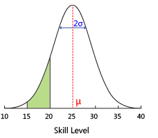

# TrueSkill Calculator

A simple and fast online calculator for the TrueSkill rating system.

https://trueskill-calculator.vercel.app/

## Table of Contents

- [What is TrueSkill?](#what-is-trueskill)
- [Why?](#why)
- [Usage](#usage)
    - [Website](#website)
    - [API](#api)
    - [Legacy Version](#legacy-version)
- [Configuration](#configuration)
    - [Config Settings](#config-settings)
    - [Website Settings](#website-settings)
- [Contributing](#contributing)
- [Running locally](#running-locally)
- [License](#license)
- [Packages used](#packages-used)

## What is TrueSkill?

TrueSkill is a modern rating system for multiplayer games developed and patented by Microsoft Research.
It is used in many games, including Halo, Gears of War, Forza Motorsport, Tom Clancy's: Rainbow Six
Siege and many, many more. It uses a bayesian approach to calculate the skill of each player in a
game. It is one of the most popular rating systems, besides [Elo](https://en.wikipedia.org/wiki/Elo_rating_system) and [Glicko-2](https://en.wikipedia.org/wiki/Glicko_rating_system).

A player's rating is represented by a Gaussian distribution, which is a bell curve. The mean of the
distribution represents the player's skill, called Mu (µ), and the standard deviation represents
the player's uncertainty about their skill, called Sigma (σ). The higher the standard deviation,
the more uncertain the player is about their skill. This means that the real skill of a player is
somewhere within μ±3σ, with a 99% confidence.



The TrueSkill algorithm is very good at asserting the skill of a player <i>quickly</i>. Here is
a table of the minimum amount of games needed to roughly determine a player's skill.

| Game Mode                   | Minimum Games Needed |
| --------------------------- | -------------------- |
| 16 Players Free-For-All     | 3                    |
| 8 Players Free-For-All      | 3                    |
| 4 Players Free-For-All      | 5                    |
| 2 Players Free-For-All      | 12                   |
| 4 Teams with 2 Players each | 10                   |
| 4 Teams with 4 Players each | 20                   |
| 2 Teams with 4 Players each | 46                   |
| 2 Teams with 8 Players each | 91                   |

For more information, you can read the original paper on TrueSkill here:  
[TrueSkill(TM): A Bayesian Skill Rating System](https://www.microsoft.com/en-us/research/wp-content/uploads/2007/01/NIPS2006_0688.pdf)

## Why?

The original, official TrueSkill calculator by Microsoft seems to have gone offline in 2018 and I could not find any replacement. [Link to Wayback Machine](https://web.archive.org/web/20230000000000*/http://boson.research.microsoft.com:80/trueskill/rankcalculator.aspx).  
So, I decided to create my own.

## Usage

You can use this calculator via the website, or via the provided, 100% free, API.

### Website

- Add or remove Teams and Players and assign each the correct number
- Assign each Team the correct Rank, meaning Placement in the game. The lower the rank, the better. If two or more Teams draw with each other, assign them the same rank.
- Assign Weights between 0 and 1 to each Player. A Weight of 1 means the Player has played the whole match, and values below 1 mean the Player has left the game early. A Weight of 0 means the Player has not played at all.
- Optionally you can name each Team and Player to make it easier to identify them.
- The new ratings will be calculated automatically

The expected results will appear in the Resulting Teams section. The teams will be updated with the new ranks, the difference from before the match, and their expected score.

You can also see the Match Quality which is the percent chance of your match ending in a draw. The higher this value, the closer your match will be.

You can also import and export the teams as CSV or JSON for ease of use.

### API

Instead of using the website directly, you can also use the provided API to calculate your results.

See also the OpenAPI Spec: [openapi.yml](./openapi.yml)

`POST https://trueskill-calculator.vercel.app/api/trueskill`

<details>
<summary>Sample Request Body:</summary>

The config param is optional, the rest is required.  
You need at least 2 teams, and every team needs at least 1 player.

```json
{
    "config": {
        "beta": 4.166666666666667,
        "tau": 0.08333333333333333,
        "drawProbability": 0.1
    },
    "teams": [
        {
            "name": "Team Red",
            "rank": 1,
            "players": [
                {
                    "name": "Alice",
                    "rating": [25, 8.333],
                    "weight": 1
                },
                {
                    "name": "Bob",
                    "rating": [26.5, 8.1],
                    "weight": 1
                },
                {
                    "name": "Charlie",
                    "rating": [24.5, 8],
                    "weight": 1
                }
            ]
        },
        {
            "name": "Team Blue",
            "rank": 2,
            "players": [
                {
                    "name": "Dana",
                    "rating": [23, 8.5],
                    "weight": 1
                },
                {
                    "name": "Eli",
                    "rating": [22, 8.4],
                    "weight": 1
                },
                {
                    "name": "Frank",
                    "rating": [24, 8.3],
                    "weight": 1
                }
            ]
        },
        {
            "name": "Team Green",
            "rank": 3,
            "players": [
                {
                    "name": "Grace",
                    "rating": [20, 8.7],
                    "weight": 1
                },
                {
                    "name": "Hannah",
                    "rating": [21, 8.6],
                    "weight": 1
                },
                {
                    "name": "Ian",
                    "rating": [22, 8.5],
                    "weight": 1
                }
            ]
        }
    ]
}
```

</details>

<details>
<summary>Sample Response Body:</summary>

```json
{
    "teams": [
        {
            "name": "Team Red",
            "rank": 1,
            "players": [
                {
                    "name": "Alice",
                    "rating": [27.839367341244593, 7.876704169661205],
                    "weight": 1,
                    "ratingChanges": [2.839367341244593, -0.45629583033879495],
                    "suggestedRank": 4.209254832260978
                },
                {
                    "name": "Bob",
                    "rating": [29.18281911018984, 7.681630162349011],
                    "weight": 1,
                    "ratingChanges": [2.6828191101898398, -0.4183698376509888],
                    "suggestedRank": 6.137928623142805
                },
                {
                    "name": "Charlie",
                    "rating": [27.11699253438727, 7.597223761817734],
                    "weight": 1,
                    "ratingChanges": [2.6169925343872684, -0.40277623818226616],
                    "suggestedRank": 4.325321248934067
                }
            ],
            "expectedScore": 0.44046420086754107
        },
        {
            "name": "Team Blue",
            "rank": 2,
            "players": [
                {
                    "name": "Dana",
                    "rating": [23.01515213307437, 7.874194724875769],
                    "weight": 1,
                    "ratingChanges": [0.0151521330743698, -0.6258052751242307],
                    "suggestedRank": -0.6074320415529364
                },
                {
                    "name": "Eli",
                    "rating": [22.01479774354002, 7.796601180168476],
                    "weight": 1,
                    "ratingChanges": [
                        0.014797743540018615, -0.6033988198315248
                    ],
                    "suggestedRank": -1.3750057969654073
                },
                {
                    "name": "Frank",
                    "rating": [24.014447547964632, 7.718445900529321],
                    "weight": 1,
                    "ratingChanges": [
                        0.014447547964635987, -0.5815540994706794
                    ],
                    "suggestedRank": 0.8591098463766684
                }
            ],
            "expectedScore": 0.3273178872908227
        },
        {
            "name": "Team Green",
            "rank": 3,
            "players": [
                {
                    "name": "Grace",
                    "rating": [16.889175790765307, 8.197200555477988],
                    "weight": 1,
                    "ratingChanges": [-3.1108242092346927, -0.5027994445220116],
                    "suggestedRank": -7.702425875668656
                },
                {
                    "name": "Hannah",
                    "rating": [17.96027147265146, 8.114697089485928],
                    "weight": 1,
                    "ratingChanges": [-3.03972852734854, -0.48530291051407204],
                    "suggestedRank": -6.383819795806321
                },
                {
                    "name": "Ian",
                    "rating": [19.030545239140086, 8.031771289730967],
                    "weight": 1,
                    "ratingChanges": [-2.9694547608599144, -0.4682287102690328],
                    "suggestedRank": -5.064768630052814
                }
            ],
            "expectedScore": 0.23221791184163632
        }
    ],
    "matchQuality": 0.168544066695238
}
```

</details>

### Legacy Version

This calculator has undergone a redesign.  
If you'd like to access the legacy version, visit https://trueskill-calculator-legacy.vercel.app/ (Website only)  
The code is accessible via this repositories [`legacy` branch](https://github.com/atomflunder/TrueSkill-Calculator/tree/legacy), or the [mirror repository](https://github.com/atomflunder/TrueSkill-Calculator-Legacy).

## Configuration

### Config Settings

The TrueSkill algorithm allows you to freely set these config parameters to tweak the rating calculations:

| Parameter            | Description                                                                                                                                                         | Default Value    |
| -------------------- | ------------------------------------------------------------------------------------------------------------------------------------------------------------------- | ---------------- |
| **Beta (β)**         | The distance in rating points to guarantee about a 76% chance of winning for the higher-rated player. Set higher for luck-based games, lower for skill-based games. | 25/6 ≈ 4.167     |
| **Tau (τ)**          | The additive dynamics factor. Higher values make ratings more dynamic. Winners gain more, losers lose more.                                                         | 25/300 ≈ 0.083   |
| **Draw Probability** | The probability of a draw occurring. Set higher for draw-prone games, lower for decisive games. Can be set to 0 if draws are impossible.                            | 0.1 (10% chance) |

### Website Settings

On the website there are these additional settings:

| Parameter             | Description                                     | Default Value |
| --------------------- | ----------------------------------------------- | ------------- |
| **Default Mu (μ)**    | The default value of Mu (μ) for new players.    | 25            |
| **Default Sigma (σ)** | The default value of Sigma (σ) for new players. | 25/3 ≈ 8.333  |
| **Default Team Size** | The default team size of new teams.             | 2             |

## Contributing

Contributions of any kind are always welcome.  
If you find a bug or have a feature request, please open an issue.  
Alternatively you can also open a pull request to add features and fix bugs directly.

Thanks for your help!

## Running locally

1. Clone the repository
2. Install the dependencies with `bun install`
3. Run the dev server with `bun run dev`
4. Open [localhost:3000](http://localhost:3000) in your browser

## License

This project is licensed under the MIT License. See the [LICENSE](LICENSE) file for details.  
However, please keep in mind that TrueSkill itself is patented for _commercial projects_ by Microsoft.

## Packages used

- [Vue](https://vuejs.org/)
- [Nuxt](https://vitejs.dev/)
- [shadcn/vue](https://www.shadcn-vue.com)
- [ts-trueskill](https://www.npmjs.com/package/ts-trueskill)
