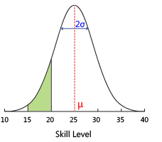

# TrueSkill Calculator

A simple and fast Online TrueSkill calculator.  
[Link to the calculator](https://trueskill-calc.vercel.app/)

## What is TrueSkill?

TrueSkill is a modern rating system for multiplayer games developed and patented by Microsoft Research.
It is used in many games, including Halo, Gears of War, Forza Motorsport, Tom Clancy's: Rainbow Six
Siege and many, many more. It uses a bayesian approach to calculate the skill of each player in a
game. It is one of the most popular rating systems, besides [Elo](https://en.wikipedia.org/wiki/Elo_rating_system) and [Glicko-2](https://en.wikipedia.org/wiki/Glicko_rating_system).

A player's rating is represented by a Gaussian distribution, which is a bell curve. The mean of the
distribution represents the player's skill, called Mu (µ), and the standard deviation represents
the player's uncertainty about their skill, called Sigma (σ). The higher the standard deviation,
the more uncertain the player is about their skill. This means that the real skill of a player is
somewhere within μ±3σ, with a 99% confidence.

The TrueSkill algorithm is very good at asserting the skill of a player <i>quickly</i>. Here is
a table of the minimum amount of games needed to roughly determine a player's skill.

| Game Mode                   | Minimum Games Needed |
| --------------------------- | -------------------- |
| 16 Players Free-For-All     | 3                    |
| 8 Players Free-For-All      | 3                    |
| 4 Players Free-For-All      | 5                    |
| 2 Players Free-For-All      | 12                   |
| 4 Teams with 2 Players each | 10                   |
| 4 Teams with 4 Players each | 20                   |
| 2 Teams with 4 Players each | 46                   |
| 2 Teams with 8 Players each | 91                   |

For more information, you can read the original paper on TrueSkill here:  
[TrueSkill(TM): A Bayesian Skill Rating System](https://www.microsoft.com/en-us/research/wp-content/uploads/2007/01/NIPS2006_0688.pdf)

## Why?

The original, official TrueSkill calculator by Microsoft seems to have gone offline in 2018 and I could not find any replacement. [Link to Wayback Machine](https://web.archive.org/web/20230000000000*/http://boson.research.microsoft.com:80/trueskill/rankcalculator.aspx).  
So, I decided to create my own.

## How to use

- Add or remove Teams and assign each the correct number
- Assign each Team the correct Rank, meaning Placement in the game. The lower the rank, the better.  
  If two or more Teams draw with each other, assign them the same rank.
- Assign Weights between 0 and 1 to each Player.  
   A Weight of 1 means the Player has played the whole match, and values below 1 mean the Player has left the game early. A Weight of 0 means the Player has not played at all.
- Optionally you can name each Team and Player to make it easier to identify them.

The expected results will appear in the Resulting Teams section.

You can also see the Match Quality which is the percent chance of your match ending in a
draw. The higher this value, the closer your match will be.

When you're done you can copy the resulting Teams to your clipboard in CSV format all at once or
one-by-one.

This calculator supports up to 128 Teams with up to 256 players each.

## Configuration

You can configure the following settings to adjust the algorithm to your needs:

- **Default Mu (μ):** The default Value of Mu (μ) for new players. This is the rating value that new players will start with.  
   By default set to 25.
- **Default Sigma (σ):** The default Value of Sigma (σ) for new players. This is the rating uncertainty that new players will start with.  
  By default set to 25/3 ≈ 8.333.
- **Beta (β):** The distance in rating points to guarantee about a 76% chance of winning for the higher rated player. If your game is more luck based, set this to a higher value. If your game is more reliant on pure skill, set this to a lower value.  
   By default set to 25/6 ≈ 4.167.
- **Tau (τ):** The additive dynamics factor, the higher the value, the more dynamic the ratings will be. This means the winner will gain more rating, and the loser will lose more rating.  
  By default set to 25/300 ≈ 0.083.
- **Draw Probability:** The probability of a draw occurring. If your game has a high chance of ending in a draw set this to a higher value. If your game has a low chance of ending in a draw set this to a lower value. You can also set this to 0 if draws are impossible.  
  By default set to 0.1, meaning a 10% chance of a draw ocurring.

## Contributing

Contributions of any kind are always welcome.  
If you find a bug or have a feature request, please open an issue.  
Alternatively you can also open a pull request to add features and fix bugs directly.

Thanks for your help!

## Running locally

1. Clone the repository
2. Install the dependencies with `npm install`
3. Run the dev server with `npm run dev`
4. Open [localhost:5173](http://localhost:5173) in your browser

## License

This project is licensed under the MIT License. See the [LICENSE](LICENSE) file for details.

## Packages used

- [Svelte](https://svelte.dev/)
- [ts-trueskill](https://www.npmjs.com/package/ts-trueskill)
