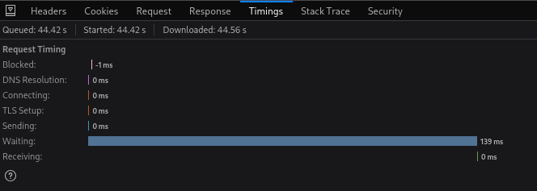
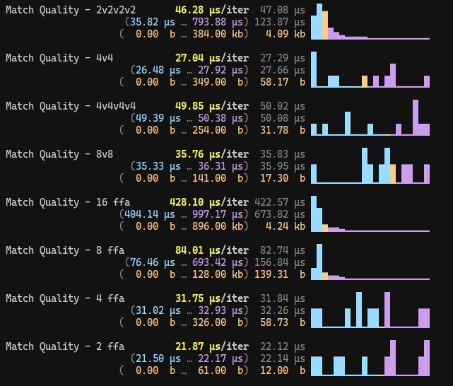
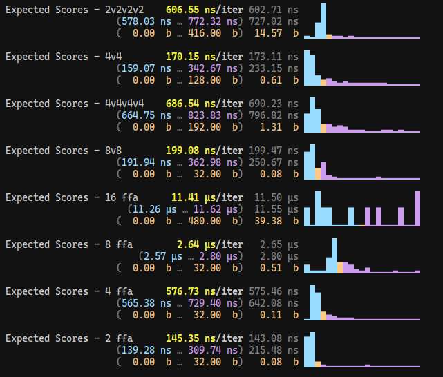
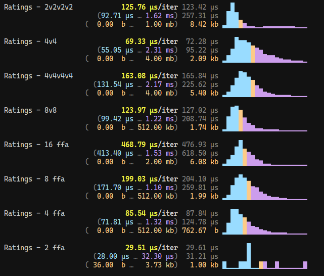

# TrueSkill Calculator - Benchmarks

This is more for fun, just to see how the utility functions perform. This is completely useless for the actual speed of the API, since you will spend >99.999% of the time waiting on your network:

API timings:

Anyways, here are the results on my machine:

### Match Quality:

### Expected Score:

### Ratings:

